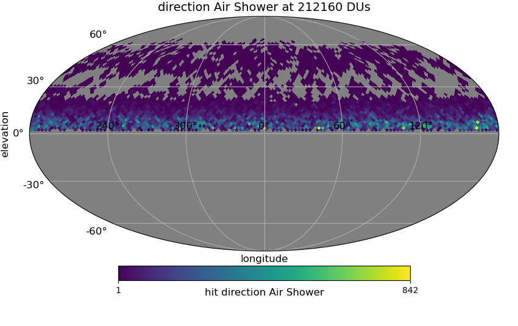
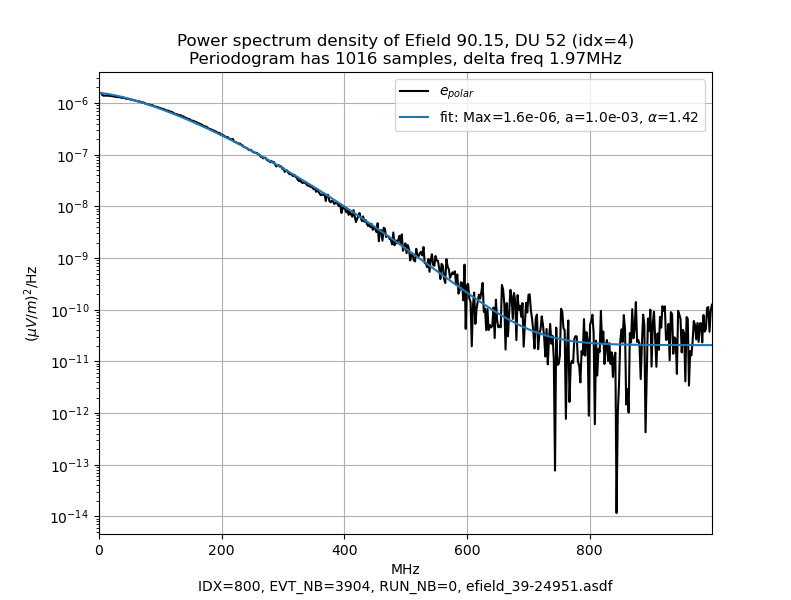

# grandpolar
DC2 proposition of reconstruction based on polarization of air shower EField

## Installation

* git clone https://github.com/grand-mother/grandpolar.git
* python -m pip install git+https://github.com/luckyjim/RadioShower.git@0.1.1
* cd grandpolar
* source gpol_init.sh

## Dataset DC2 Polar

on CCIN2P3:
* /sps/grand/simu/dc2_polar/v2

from DC2 simulation:
* /sps/grand/DC2Training/ZHAireS

After trigged voltage 10% of traces are selected, finaly DC2 polar dataset contents arround :
* 5.000 events
* 200.000 traces 

Here the Healpix hit map




### Efield

`efield_xx_yyyy.asdf` : Efield triggered
 * sampling at 2000 MHz
 * only polarized component
 * polar angle estimated

### Antenna voltage air shower

* `volt-ash_xx_yyyy.asdf` : GP300 response to Efield `efield_xx_yyyy.asdf`
    * sampling 500MHz
    * no noise
* Transfer functions used 
    * Effective length model HFSS : Light_GP300Antenna_XXarm_leff.npz
    * RF Chain DC2.1rc, see [gp300 directory](gp300/readme.md)

### Antenna voltage background 

GP300 response to Efield `efield_xx_yyyy.asdf` by changing the polarization angle and remove Cerenkov ring by $1/r^2$ amplitude decrease.
 
* `volt-bkg-90_xx_yyyy.asdf` : by adding 90 to the polarization 

* `volt-bkg-rnd_xx_yyyy.asdf` : with random polarization angle 

As the polar angle is changed, antenna response can't be very low and the trace will not have a pulse that would not pass the trigger.

### IO access

It's James Webb Telescope data format, aka [ASDF](https://www.asdf-format.org/en/latest/index.html) for Advanced scientific Data Format. Here [python API](https://www.asdf-format.org/projects/asdf/en/stable/index.html#asdf)

#### Quick look

With: `asdftool info <file.asdf>`

```bash
cca013:v2>asdftool info volt-ash_0-24984.asdf
root (AsdfObject)
├─asdf_library (Software)
│ ├─author (str): The ASDF Developers
│ ├─homepage (str): http://github.com/asdf-format/asdf
│ ├─name (str): asdf
│ └─version (str): 5.0.0
├─history (dict)
│ └─extensions (list)
│   └─[0] (ExtensionMetadata)
│     ├─extension_class (str): asdf.extension._manifest.ManifestExtension
│     ├─extension_uri (str): asdf://asdf-format.org/core/extensions/core-1.6.0
│     ├─manifest_software (Software)
│     │ ├─name (str): asdf_standard
│     │ └─version (str): 1.4.0
│     └─software (Software)
│       ├─name (str): asdf
│       └─version (str): 5.0.0
├─events (NDArrayType)
│ ├─shape (tuple)
│ │ └─[0] (int): 462
│ └─dtype (VoidDType): [('evt2ftr', '<i4'), ('run_nb', '<i4'), ('event_nb', '<i4'), ('idx', '<i4'), ('energy', '<f4'), ('xmax_nwu', '<f4', (3,)), ('core_nwu', '<f4', (3,))]
├─infos_file (dict)
│ ├─author (str): Jean-Marc Colley
│ ├─comment (str)
│ ├─date (str): 2025-10-10T12:22
│ ├─description (str): Files events/traces from RadioShower library
│ ├─history (str)
│ ├─laboratory (str): LPNHE/IN2P3/CNRS France
│ ├─project (str): GRAND RadioShower
│ ├─repository (str): https://github.com/luckyjim/RadioShower
│ └─version (str): 0.1
├─meta (dict)
│ ├─f_samp_mhz (float): 500.0
│ ├─infile (str): /sps/grand/DC2Training/ZHAireS/sim_Xiaodushan_20221025_220000_RUN0_CD_ZHAireS_0011/efield_0-24984_L0_0000.root
│ ├─mag_field (dict)
│ │ ├─dec_deg (float): 0.12999999523162842
│ │ ├─inc_deg (float): 61.599998474121094
│ │ └─modul_uT (float): 56.481998443603516
│ ├─nb_evts (int): 462
│ ├─nb_traces (int): 20916
│ ├─site (str): Xiaodushan
│ ├─type_trace (str): Voc
│ └─unit (str): $\mu V$
├─mtraces (NDArrayType)
│ ├─shape (tuple)
│ │ └─[0] (int): 20916
│ └─dtype (VoidDType): [('du_id', '<i4'), ('start_s', '<i8'), ('start_ns', '<f8'), ('azi', '<f4'), ('d_zen', '<f4')]
├─network (NDArrayType)Calibration file
│ ├─shape (tuple)
│ │ └─[0] (int): 400
│ └─dtype (VoidDType): [('du_id', '<i4'), ('pos_nwu', '<f4', (3,))]
└─traces (NDArrayType)
  ├─shape (tuple)
  │ ├─[0] (int): 20916
  │ ├─[1] (int): 3
  │ └─[2] (int): 1024
  └─dtype (Float32DType): float32
```

#### Event viewer

With: `rshower_view.py` from RadioShower, close to GRANDLIB event viewer

```bash 

$ rshower_view.py -h 
usage: rshower_view.py [-h] [-f] [--time_val] [-t TRACE] [-i INDEX] [--trace_image] [--list_du] [--dump DUMP] [--info] file

Muliti events viewer from GRAND network GP13

positional arguments:
  file               path and name of file GRAND

options:
  -h, --help         show this help message and exit
  -f, --footprint    interactive plot (double click) of footprint, max value for each DU
  --time_val         interactive plot, value of each DU at time t defined by a slider
  -t, --trace TRACE  plot trace x,y,z and power spectrum of detector unit (DU)
  -i, --index INDEX  Select event with index <index>, given by -i option, index is always > 0 or = 0
  --trace_image      interactive image plot (double click) of norm of traces
  --list_du          list of identifier of DU
  --dump DUMP        dump trace of DU
  --info             Some information and plots about the contents of the file
```


#### With python API

```python
from rshower.io.events.asdf_traces import AsdfReadTraces

fevents = AsdfReadTraces(file_asdf)
evt10 = fevents.get_event(10)
```

Where :
* `fevents.d_asdf` contents raw data in file, by example `fevents.d_asdf["events"]` is a structured numpy array with named column
    * evt2ftr : index of first trace in event 
    * run_nb : run number of event from ROOT file
    * event_nb : event number of event from ROOT file
    * idx : index of event in ROOT file
    * energy : energy of astroparticule
    * xmax_nwu : Xmax position in NWU GRAND Frame
    * core_nwu : Core position in NWU GRAND Frame
    
* `evt10` is a `Handling3dTraces` object like in GRANDLIB, see [tutorial](https://github.com/grand-mother/grand/blob/dev_sim2root/examples/basis/class_Handling3dTraces.ipynb), example of attributs :
    * `evt10.traces` is a numpy array with shape (nb_du, 3, 1024)
    * `evt10.d_simu` is a dictionary of parameters of simulation (xmax, core, energy) 


## GP300 galactic response (noise)

DC2 polar dataset is without noise, you can create noise on the fly during your processing with `GalacticRespGP300` class and add noise to `Handling3dTraces` object like `evt10`

```python
from gpol.simu.gal_gp300 import GalacticRespGP300

size_out = 1024
fs_mhz = 500
lst = 18
gresp = GalacticRespGP300()
gresp.set_paramters_simu(fs_mhz, size_out)
gresp.add_galactic_component(evt10, lst)
```

With galactic ASD and RF chain defined in [gp300 directory](gp300) by numpy file. The method of "noise generator" from PSD is explained in [notebook of mogwai package](https://github.com/luckyjim/mogwai/blob/main/doc/noise_wf.ipynb).

## Models

#### Polar angle of Efield

#### Relative amplitude of the voltage along the direction

#### PSD Efield model with 4 parameters

$PSD(f)=M.\exp^{-a.f^{\alpha}}+\sigma^2$ 



#### PSD Efield along the direction and amplitude of the voltage

## Polar trigger level 2

## Polar Wiener reconstruction of Efield
